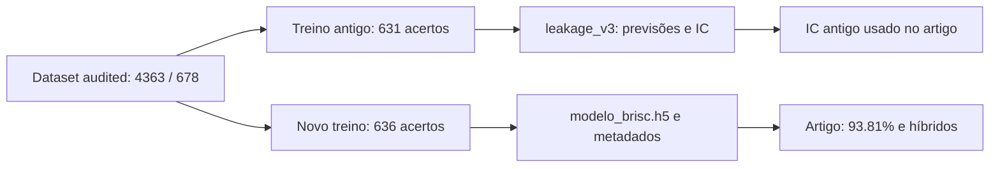

# Auditoria BRISC25: origem dos resultados e integridade do benchmark

5 de outubro de 2026. Repositório do artigo: https://github.com/kitcat-lab/brisc25-tumor-classification, commit confirmado `fc626c3d1c29e7b7763d88ec4d33b8764126e384`.

## Conclusão

Os 93,81% da CNN são reais e reproduzíveis com o modelo local correto. A exportação pública mistura resultados de duas execuções da CNN e o manuscrito usa um intervalo de confiança da execução anterior. O log original da auditoria existe no WSL e corresponde ao dataset do artigo, mas não foi publicado. Existe ainda um problema metodológico mais sério: o pHash classificou como duplicados alguns pares visivelmente distintos. A descrição do limiar como conservador e limitado a imagens visualmente indistinguíveis não é sustentada por esses exemplos.

Não há evidência nesta auditoria de que as accuracies principais tenham sido inventadas. Existem modelos locais, dados e resultados suficientes para reconstruir uma parte importante do trabalho. Isso não torna automaticamente válido todo o protocolo de curadoria ou todas as afirmações do manuscrito.

## O que foi efetivamente verificado

- Inventário de pastas relacionadas em Desktop, Documents, Downloads e OneDrive; inspeção dos repositórios locais e dos seus remotes.
- Inferência dos modelos CNN principal, CNN antiga, VGG16 e RadImageNet nas mesmas 678 imagens, sem repetir treino neural.
- Inferência dos híbridos CNN+LightGBM e VGG16+LightGBM a partir dos modelos, scalers e classificadores locais.
- Novo ajuste de LightGBM sobre as features db4/NL16, seguindo os parâmetros do script de figuras, para diagnosticar a correspondência do classical ML.
- Hashes do corpus original de 6000 imagens e comparação do dataset limpo do WSL com o Desktop.
- Verificação de todas as exclusões do log original e pesquisa de pares pHash ≤5 entre todas as imagens retidas.
- Bootstrap ordinary e estratificado e McNemar sobre previsões alinhadas por filename; comparação com os números do PDF.

Os originais e os repositórios não foram modificados. As únicas novas escritas estão nesta pasta de auditoria. Não houve push para GitHub. Não foi feita uma avaliação clínica das imagens nem uma revisão manual de todas as 909 exclusões por pHash.

## 1. O problema pHash exige revisão da curadoria

O corpus limpo não contém pares com distância pHash ≤5, dentro ou entre splits, segundo a implementação `imagehash.phash` utilizada. Isto verifica a propriedade matemática do filtro; não demonstra que todas as imagens eliminadas eram realmente duplicados.

O log identifica **10 pares eliminados com classes diferentes**, todos por pHash. Inspecionei visualmente três desses pares. Os contornos, padrões internos e regiões brilhantes diferem de forma evidente; não são imagens visualmente indistinguíveis. Recalcular pHash nas imagens originais dá distâncias 4, 4 e 2, respetivamente. Portanto, a semelhança do hash global pode ocorrer entre imagens distintas.

Exemplo especialmente claro:

- Imagem eliminada: `train/meningioma/brisc2025_train_01529_me_ax_t1.jpg`.
- Imagem associada: `train/glioma/brisc2025_train_00057_gl_ax_t1.jpg`.
- Distância pHash recalculada: **4**.

As imagens têm aspetos diferentes, apesar de passarem o limiar. Isto é uma avaliação de semelhança visual, não uma confirmação dos diagnósticos dos rótulos. Ver [os três exemplos](../figures/audit/cross_class_examples.png) e `audit_log_enriched_diagnostic.csv`.

**Consequência:** não se pode descrever as 959 exclusões como 959 imagens comprovadamente leaked ou duplicadas. A curadoria pode ter retirado exemplos legítimos e alterado a composição das classes. Esta auditoria não estima quantas das outras exclusões são falsos positivos, nem o efeito sobre accuracy.

**Correção necessária:** revisão manual dos pares sinalizados, especialmente interclasse e intersplit, acompanhada de análise de sensibilidade e de uma política explícita para confirmar duplicação. Não basta mudar o limiar para outro número sem validação: há um exemplo visualmente distinto com distância 2. Se a revisão alterar a composição do benchmark, os resultados dependentes do split revisto terão de ser recalculados.

## 2. A origem de 93,81% foi encontrada e confirmada

Há duas execuções distintas:

| Execução | Modelo local | Acertos / 678 | Accuracy | F1 macro | AUC macro-OvR |
|---|---|---:|---:|---:|---:|
| CNN antiga | `brisc_gui/leakage_v3/audited/model.h5` | 631 | 93,0678% | 93,2684% | 99,3474% |
| CNN principal posterior | `brisc_gui/modelo_brisc.h5` | 636 | 93,8053% | 93,9363% | 99,5489% |

Os valores da segunda linha arredondam exatamente para **93,81 / 93,94 / 99,55** no manuscrito.

O script `retrain_w2_cnn_v3.py` volta a treinar e substitui o modelo principal `modelo_brisc.h5`, mas não atualiza os CSV em `leakage_v3`. Os metadados locais, também publicados em `topmodels/modelo_brisc_v3_meta.json`, documentam a substituição. Os timestamps locais colocam o modelo antigo a 1 de julho e o principal a 2 de julho de 2026; estes timestamps são evidência auxiliar, não uma história Git completa.

O modelo principal tem SHA256 `5d8f45809dba2fa412459d73a24de74cad2e2848735eb7a304a0a8bc823cc7ee`. O antigo tem SHA256 `1b24a6ecfaf419f68e5af64e09b18b813dbdf7f9bed2af7a7b176b59f09290d5`.

**Diagnóstico:** mistura de execuções na publicação, não falta de fundamento numérico para 93,81%. A inferência atual remove a incerteza da revisão inicial quanto à origem desse número.

## 3. Intervalo de confiança da CNN pertence à execução errada

O manuscrito associa 93,81% a IC95 [91,2; 94,7]. O gerador de figuras hardcodes `93.81,91.15,94.69`; estes limites são os guardados para a execução antiga de 93,07%.

Para o modelo principal, nesta auditoria, com 1000 resamples e seed 42:

- Bootstrap estratificado por classe, ordem por classe e filename: **[91,89; 95,43]%**.
- Bootstrap ordinary na mesma ordem: **[91,89; 95,58]%**.
- Bootstrap ordinary reproduzindo a ordem dataframe shuffled com seed 42: **[91,74; 95,58]%**.

Com um número finito de resamples, reordenar os dados pode mudar ligeiramente os percentis quando a sequência pseudoaleatória é fixada. Deve escolher-se uma implementação e ordem identificadas e gerar todas as tabelas a partir dela. O IC publicado deve ser substituído por um calculado sobre as previsões do modelo principal.

Os scripts públicos chamam o método de estratificado mas usam amostragem global `rng.randint(0,n,n)`. Os dois métodos foram guardados separadamente em `verified_metrics.json`.

## 4. O log correto existe no WSL

Localização original: `/root/brisc/data/brisc2025_clean/audit_log.csv`.

| Verificação | Resultado |
|---|---:|
| Corpus original | 6000 imagens |
| Corpus retido | 5041 imagens |
| Train retido | 4363 |
| Test retido | 678 |
| Exclusões MD5 | 50 |
| Exclusões pHash | 909 |
| Total do log | 959 |

O conjunto de caminhos retirados do corpus corresponde **exatamente** ao conjunto registado no log. Os nomes e bytes das imagens retidas no Desktop correspondem ao corpus limpo do WSL.

Entre as 909 exclusões pHash, **296** ligam splits diferentes e **613** ligam imagens do mesmo split. Portanto, 909 near-duplicates não equivale a 909 casos de leakage train–test. Para as exclusões MD5, o log original não guarda o representante retido; reconstruí peers por MD5 apenas para diagnóstico, sem os apresentar como representantes historicamente confirmados.

`Documents/brisc2025_clean_v2/audit_log.csv` é outra auditoria: **1114 exclusões**, dataset de **4886 imagens**, train 3930 / test 956. Esse ficheiro não deve ser usado como log do artigo. O log de 959 foi copiado para `original_audit_log_959.csv`; `dataset_manifest_verified.csv` fornece caminhos relativos, splits, classes, hashes e inclusão.

## 5. Principais resultados profundos foram reproduzidos

| Configuração | Accuracy | F1 | AUC |
|---|---:|---:|---:|
| CNN principal | 93,8053% | 93,9363% | 99,5489% |
| CNN + LightGBM | 96,7552% | 96,7661% | 99,7693% |
| VGG16 softmax | 97,9351% | 97,9636% | 99,8606% |
| VGG16 + LightGBM | 98,6726% | 98,6924% | 99,8285% |
| RadImageNet softmax | 72,1239% | 72,7839% | 90,8115% |

VGG16 e RadImageNet produzem exatamente as mesmas classes previstas dos CSV públicos, após reconstruir a ordem shuffled usada no treino. Os híbridos foram reavaliados a partir dos modelos e classificadores locais. Não foram repetidos nesta fase os modelos EfficientNet e ConvNeXt; as suas accuracies nos CSV tinham sido verificadas na revisão anterior.

## 6. Testes pareados: conclusão principal confirmada, matriz RadImageNet desatualizada

As três comparações entre CNN principal, VGG16 e VGG16+LightGBM reproduzem exatamente os p-values nominais publicados. VGG16 versus híbrido tem 2 imagens certas apenas por VGG16 e 7 certas apenas pelo híbrido. McNemar com correção de continuidade dá **p = 0,182422439**, e Holm mantém esse valor. O teste exato dá p = 0,1796875. Nenhum sustenta uma melhoria estatisticamente significativa do híbrido.

Os três contrastes envolvendo RadImageNet não reproduzem a matriz pública, embora as accuracies e previsões públicas individuais de RadImageNet se confirmem:

| Comparação | p público | p reconstruído |
|---|---:|---:|
| CNN vs RadImageNet | 9,916e-29 | 6,056e-29 |
| VGG16 vs RadImageNet | 2,972e-37 | 1,800e-37 |
| Híbrido VGG16 vs RadImageNet | 5,839e-40 | 3,532e-40 |

Os valores públicos são compatíveis com discordâncias que dão a RadImageNet mais um acerto (490 em vez de 489). Não identifiquei a execução que originou essa matriz. A divergência não altera as conclusões de significância, mas obriga a regenerar a matriz a partir das previsões finais identificadas por imagem.

Holm no PDF está aritmeticamente correto para a matriz antiga. Falta no repositório uma rotina/exportação que torne essa transformação reproduzível. Os resultados atuais estão em `mcnemar_original_family_verified.csv`, com valores nominais, exatos e Holm para os mesmos seis contrastes.

## 7. Classical ML: resumo e novo ajuste Python são execuções diferentes

O resumo público reporta 90,71%, F1 90,85%, AUC 98,34%, para LightGBM/db4/NL16/198 features. As features locais são as mesmas publicadas. Confirmou-se que o test Excel contém os mesmos 678 filenames e rótulos do corpus profundo.

Ao reajustar LightGBM conforme os parâmetros do script de figuras no ambiente local atual, obtive **614/678 = 90,56%**, F1 90,71%, AUC 98,48%. Isto não reproduz os 90,71% do resumo. Pode haver diferenças entre a execução original e a reimplementação Python; a auditoria não isolou a causa. O modelo clássico originalmente avaliado precisa de previsões/probabilidades e metadados próprios. Não substituir silenciosamente a linha original pelos resultados do refit.

Como diagnóstico separado, os testes pareados desse refit contra VGG16 e o híbrido são significativos, mesmo após Holm nos quatro contrastes exploratórios adicionais. Estes testes estão em `classical_refit_exploratory_comparisons.csv`; não são uma recuperação dos testes da execução clássica original.

## 8. O problema de publicação foi localizado

Todos os **198** ficheiros públicos sob `inputs/` e `outputs/` têm correspondência nos artefactos originais do Desktop: **195 byte a byte** e três CSV com o mesmo texto após normalização de encoding/quebras de linha. A exportação não parece ter inventado esses ficheiros; reorganizou artefactos já existentes, mantendo inconsistências antigas e omitindo componentes necessários.

Localizações importantes:

| Local | Papel identificado |
|---|---|
| `Desktop/BRISC pos graduação/brisc_gui` | Modelos canónicos, resultados originais e scripts |
| `/root/brisc/data/brisc2025_clean` | Dataset audited usado e log de 959 |
| `/root/brisc/data_unaudited/classification_task` | Corpus original de 6000 imagens |
| `Desktop/brain_tumor_brisc_tmp` | Checkout do repositório público do artigo |
| `Desktop/brisc_2025_organized` | Checkout organizado ligado ao repositório privado |
| `Desktop/brain-tumor-brisc-2025` | Outro checkout ligado a `brain_tumor_classification` |
| `Downloads/brisc_gui` | Versão anterior; modelo com hash diferente |
| `Documents/MATLAB/BRISC2025 classification/GLCM_Features.m` | Função MATLAB ausente do repositório público |

As versões locais de `GLCM_Features.m` em Documents/MATLAB são idênticas. A função identifica Avinash Uppuluri no cabeçalho. Uma cópia foi guardada aqui como evidência; a proveniência/licença da dependência deve ser documentada antes de a integrar numa release MIT.

Os sources LaTeX localizados no projeto têm títulos antigos e não incluem a revisão Holm ou a formulação best-of-seven dos PDFs atuais. Por isso, editar esses sources sem localizar a versão revista arrisca perder alterações do manuscrito de outubro.

## Ações recomendadas

1. **Rever a curadoria pHash antes de defender que todas as exclusões são duplicados.** Publicar pares e critérios de revisão; analisar a sensibilidade e a composição resultante.
2. **Unificar a execução CNN principal.** Publicar previsões e metadados de 93,81%, manter 93,07% identificada como execução anterior e recalcular os IC da execução principal.
3. **Regenerar todas as estatísticas** a partir de filenames comuns, incluindo a matriz RadImageNet e os contrastes clássicos apenas quando a execução original estiver rastreável.
4. **Completar a publicação** com log correto de 959, manifestos, dependências MATLAB, caminhos portáveis e ambientes separados para treino, figuras e GUI.
5. **Alinhar o manuscrito e a resposta ao reviewer** com os resultados efetivamente verificados. Manter as ressalvas sobre seleção dos híbridos pelo teste e ausência de IDs de paciente.

## Ficheiros para conferir esta auditoria

- `verified_metrics.json`: resultados dos modelos e os dois tipos de bootstrap.
- `*_predictions.csv`: 678 filenames, rótulos e probabilidades, em ordem comum.
- `mcnemar_original_family_verified.csv`: seis contrastes da família original.
- `original_audit_log_959.csv`: cópia intacta do log recuperado.
- `dataset_manifest_verified.csv`: inventário original e inclusão no corpus limpo.
- `verified_dataset.json`: contagens e resultados das verificações de dados.
- `cross_class_audit_examples.png`: três pares para revisão visual.
- `verify_models.py`, `verify_dataset.py`, `additional_checks.py`: scripts executados.
- `runtime_versions.json`: versões efetivamente usadas no ambiente WSL existente.

Os scripts usam os caminhos originais locais para permitir repetir a auditoria neste computador. São scripts diagnósticos, não substitutos de uma pipeline pública portátil. A verificação pHash usa o critério do estudo e não substitui validação de semelhança visual ou independência por paciente.
